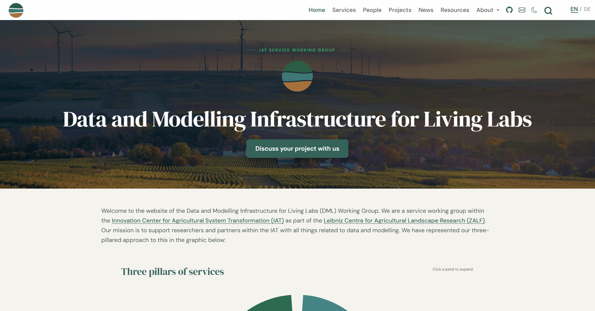
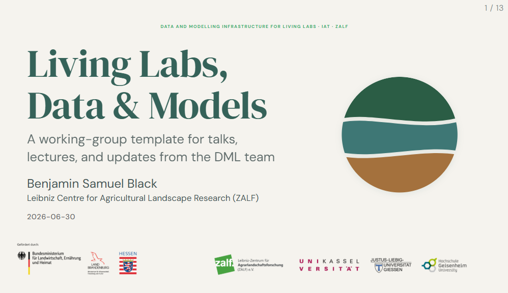
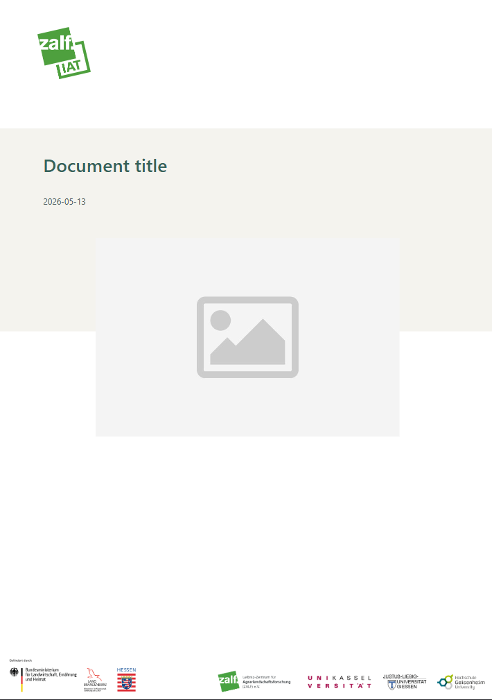

A relatively new feature of Quarto is the abilty to utilise consistent cross-project branding and visual identity using a simple additional yaml file: `_brand.yml`. THis can be used to set colors, logos, and typography across websites, reports, dashboards and presentations (in combination with Sass).

## Why This Matters For Researchers

Having a shared visual identity across the outputs of research groups and projects not only looks more professional but also reduces manually formatting when contributions need to be combined from different team members (e.g. chapters or presentations). Even if publishing systems other than Quarto are being used it is still helpful to have a structured, shared source of truth for colour codes, typography and logo sets.

## Using and sharing your brand files

Quarto applies branding automatically: drop a `_brand.yml` file in your project root (next to `_quarto.yml`) and it is picked up by every supported format — websites, reports, and dashboards  — with no further configuration (certain presentation format require a little more work). A single document outside a project works the same way if `_brand.yml` sits in the same directory.

If you'd rather keep the file elsewhere, point the `brand` key at it in `_quarto.yml`:

```yaml
brand: brand/_brand.yml
```

You can also supply separate brands for light and dark appearance, or switch branding off for an individual document:

```yaml
brand:
  light: light-brand.yml
  dark: dark-brand.yml
```

Because a `_brand.yml` is just a small, structured file, the natural way to share one across a group is to keep it in its own Git repository as the single source of truth. To pull it into a project, run:

```bash
quarto use brand <target>
```

where `<target>` can be a GitHub repo (`myorg/group-brand`), a local path, or a URL to an archive. Quarto copies the brand file and its assets (logos, fonts) into the project — they must live inside the project directory — so each project gets a self-contained, version-controlled copy that you can refresh by running the command again.

::: callout-tip
`_brand.yml` files are particularly useful when integrated within [custom templates](../advanced/templates-and-extensions.qmd) for specific document types such as reports.
:::

## A Living Example

::: {layout="[38,38,24]" layout-valign="top"}





:::

These screenshots show a website, presentation and report template for a research group all generated with the same `_brand.yml` file:

```{.yaml code-fold="true" code-summary="Show `_brand.yml`"}
meta:
  name:
    short: DML
    full: Data and Modelling Infrastructure for Living Labs (DML)
  link:
    home: https://www.zalf.de/en/struktur/iat/Pages/default.aspx

logo:
  images:
    logo-dml:
      path: dml-strata-deep-favicon.svg
      alt: "Data and Modelling Infrastructure for Living Labs (DML)"
    logo-dml-full:
      path: dml-strata-deep.svg
      alt: "Data and Modelling Infrastructure for Living Labs (DML)"
    logo-dml-lockup:
      path: dml-strata-lockup-deep.svg
      alt: "Data and Modelling Infrastructure for Living Labs (DML)"
  medium: logo-dml-lockup
  large:  logo-dml-lockup
  small:  logo-dml

color:
  palette:
    # Primary greens
    green:           "#46A84F"
    green-light:     "#9EBC83"
    green-mid:       "#80BDBD"
    # Teal family
    teal:            "#36AE6C"
    teal-dark:       "#356259"
    # Accents
    olive:           "#B1BE4D"
    sage:            "#657A4E"
    # Service colours
    transfer:        "#3E7775"
    support:         "#2B5D45"
    integration:     "#A4713D"
    # Neutrals
    slate:           "#465555"
    white:           "#FFFFFF"
    black:           "#1A1A1A"
    dark-surface:    "#162520"
    dark-border:     "#1F3530"
    paper:           "#F5F3EE"
    gray-light:      "#F5F5F5"
    gray:            "#6C6C6C"
  foreground:  slate
  background:  paper
  primary:     teal-dark
  secondary:   teal
  tertiary:    teal
  success:     teal-dark
  info:        green-mid
  warning:     olive
  danger:      "#C0392B"
  light:       paper
  dark:        slate

typography:
  fonts:
    - family: "DM Serif Display"
      source: google
    - family: "DM Sans"
      source: google
    - family: "Segoe UI Mono"
      source: system

  base:
    family: "DM Sans"
    weight: 400
    size: 28pt
    line-height: 1.45

  headings:
    family: "DM Serif Display"
    weight: 400
    color: teal-dark
    line-height: 1.15

  monospace:
    family: "Segoe UI Mono"
    weight: 400
    size: 0.85em

  monospace-inline:
    background-color: "#EAE6DF"

  link:
    color: primary
    weight: 500
    decoration: underline
```


