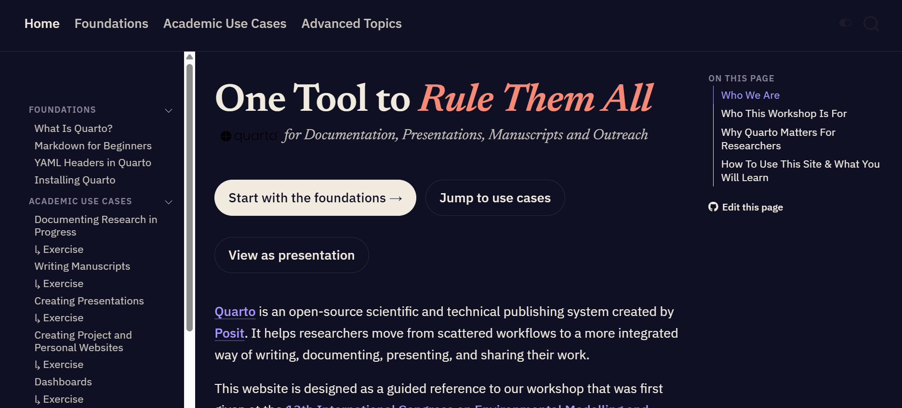
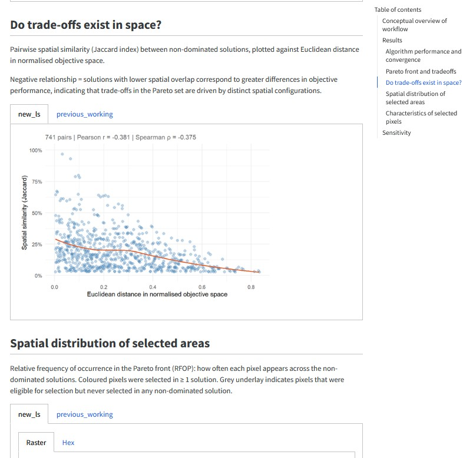
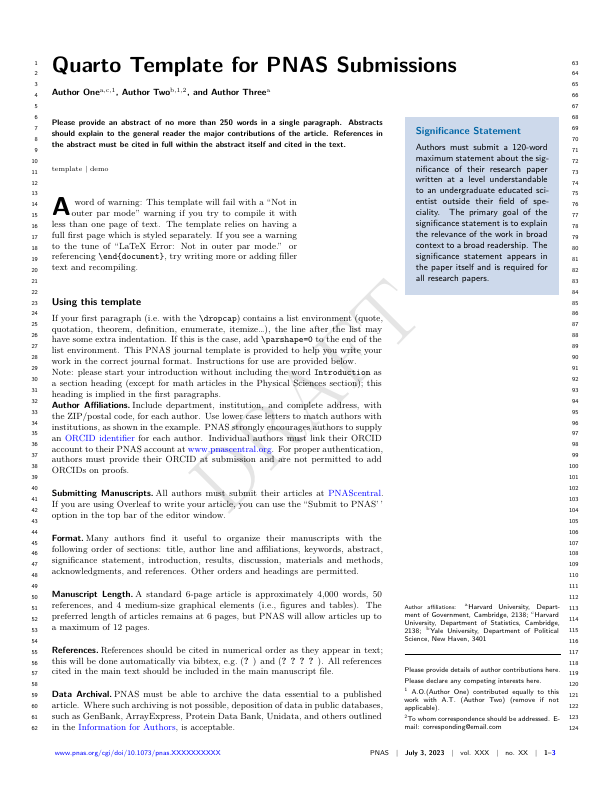
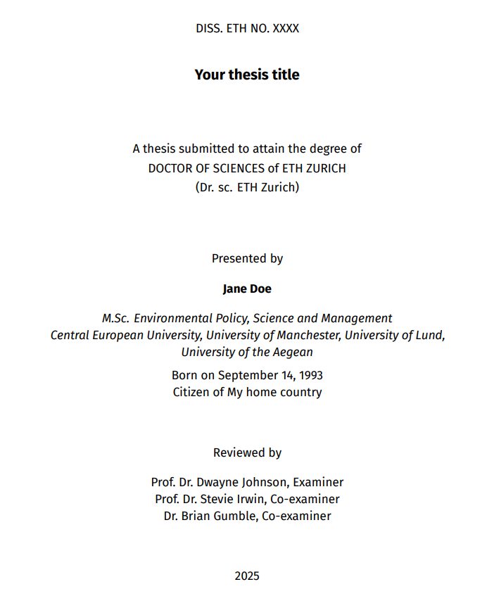
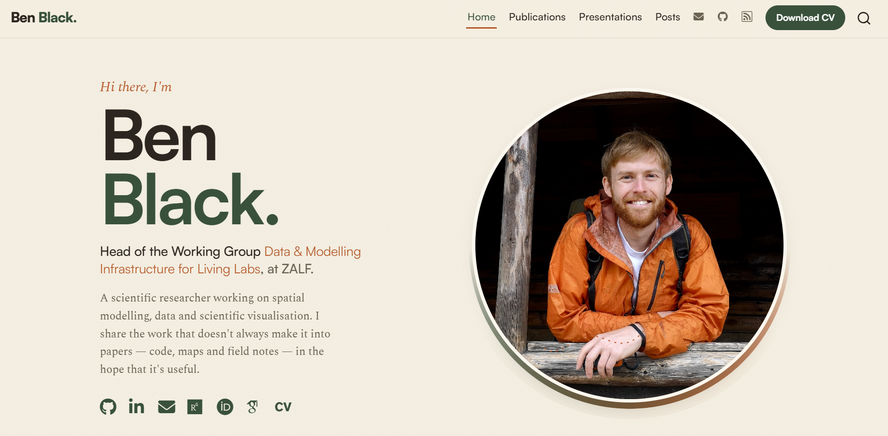
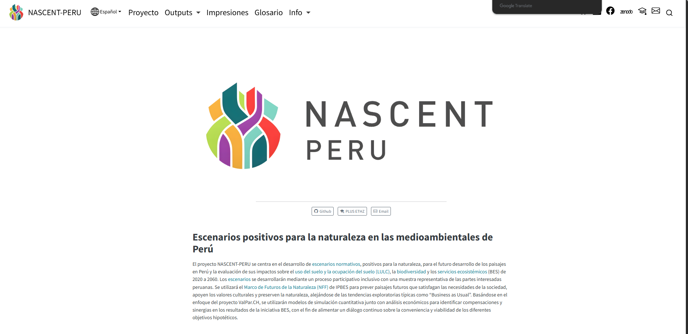
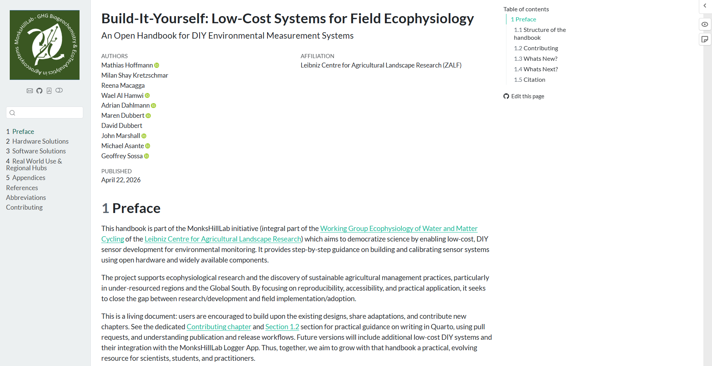

## Workshop Website {.centered-slide}

[https://iat-dml.github.io/quarto-workshop/](https://iat-dml.github.io/quarto-workshop/)


::: {.columns}

::: {.column width="70%" .center}
{height=50%}
:::

::: {.column width="30%" .center}

:::

:::


## Who We Are

::::::: {.team-grid}
::: {.card-team}
::: team-image-container
{.team-image}
:::

[Ben Black]{.team-member-name}

[Head of the group Data and Modelling Infrastructure for Living Labs]{.team-job-title}

[Leibniz Centre for Agricultural Landscape Research (ZALF)]{.team-employer}
:::

::: {.card-team}
::: team-image-container
{.team-image}
:::

[Isabel Nicholson-Thomas]{.team-member-name}

[Doctoral Researcher at Planning of Landscape and Urban Systems (PLUS)]{.team-job-title}

[ETH Zürich]{.team-employer}
:::

::: {.card-team}
::: team-image-container
{.team-image}
:::

[Manuel Kurmann]{.team-member-name}

[Research Assistant at Planning of Landscape and Urban Systems (PLUS)]{.team-job-title}

[ETH Zürich]{.team-employer}
:::
:::::::

## Why {.inline-logo}?

- Research produces **many related outputs**: Notes, manuscripts, slides etc.
- These are usually made with **disconnected tools and manual formatting**
- Quarto lets you write once in plain text, render to HTML, PDF, DOCX, slides, and more
- Focus on content, not juggling tools

## Workshop Structure {.smaller}

- **Foundations** — Quarto, Markdown, YAML 
- **Academic use cases**:

::: {.use-case-grid}

::: {.use-case}
[]{.use-case-icon aria-hidden="true"}

[Research Diary]{.use-case-name}

[Documenting your research in a reproducible way from the very beginning.]{.use-case-desc}
:::

::: {.use-case}
[]{.use-case-icon aria-hidden="true"}

[Manuscripts]{.use-case-name}

[Write in plain text; render to PDF, HTML, or DOCX, then share with collaborators.]{.use-case-desc}
:::

::: {.use-case}
[]{.use-case-icon aria-hidden="true"}

[Presentations]{.use-case-name}

[Build reveal.js talks from the same source as your research.]{.use-case-desc}
:::

::: {.use-case}
[]{.use-case-icon aria-hidden="true"}

[Websites]{.use-case-name}

[Project, lab, and personal websites to improve outreach.]{.use-case-desc}
:::

::: {.use-case}
[]{.use-case-icon aria-hidden="true"}

[Dashboards]{.use-case-name}

[Interactive dashboards for exploring and communicating your research.]{.use-case-desc}
:::

:::

::: {.use-case-note}
Each use case has a guided **exercise** which you will have time to test today.
:::

- **Advanced Topics**: Templates, multi-lingual outputs, consistent branding, AI assistance and more 

# Foundations

## What Is {.inline-logo}?

- **Open-source** scientific publishing system from Posit
- The multi-language, multi-format successor to R Markdown
- Three ingredients in one `.qmd` file:
  - **YAML** for metadata and configuration
  - **Markdown** for written content
  - **Code chunks** (R, Python, Julia, OJS) for computation

## Key Benefits

- **Plain text**: every change is a visible, trackable line (version control friendly)
- **One source, many outputs**: HTML, PDF, DOCX, slides from the same file
- **Executable code**: results are computed at render time, not pasted in
- Familiar if you know LaTeX, but simpler markup and more output formats

## Markdown in 30 Seconds

- Lightweight syntax for structure: headings, lists, links, images, emphasis
- `# Title`, `## Section`, `**bold**`, `*italic*`, `[link](url)`
- Quarto adds academic extras: citations, cross-references, callouts, figures with captions
- Mindset: describe *what* things are, let the renderer handle *how* they look

## YAML: Configuring Your Document

- The block between `---` fences at the top of a file
- Controls title, authors, date, output format, and options

``` yaml
---
title: "My Analysis"
author: "Jane Doe"
format: pdf
---
```

- Key : value pairs; indentation matters
- Same content, different YAML = different publication

# Use Cases

## Research Diary {.smaller}

::: {.columns}

::: {.column width="60%" .center}
- Capture what you tried, what worked, and *why you made decisions*
- Markdown headings separate entries by date or experiment
- Code chunks put data checks and figures right beside your notes
- Render to HTML for browsing, PDF for archiving
- Durable, shareable, searchable plain text
:::

::: {.column width="40%" .center}

:::

:::

## Manuscripts

- Narrative, citations, figures, and tables in **one reproducible document**
- **HTML/DOCX** for collaborators, **PDF/LaTeX** for journal submission
- **Numerous citation methods**: from DOI or direct integration with Zotero and databases like CrossRef and PubMed
- Templates for popular journals available (quarto-journals)
- Inline code chunks pull statistics straight from your data: no stale numbers


## Manuscripts

::: {.columns .v-center-container}

::: {.column width="50%" .center}
{height="480"}
:::

::: {.column width="50%" .center}
{height="480"}
:::

:::

**Bonus**: papers written in Quarto can be easily combined into a cumulative thesis

## Presentations

- **reveal.js**: web-native, viewable in any browser
- Reuse figures, tables, and citations from your other `.qmd` files
- Embed interactive content: live code, diagrams, iframes
- Export to **PowerPoint** or **PDF** when required
- 11 built-in themes, or create your own CSS branding
- **Caveat**: not the tool for slides requiring a lot of manual graphics design/manipulation.

## Presentations



## Websites

- Full websites from the same Markdown + YAML you already know
- Free hosting via GitHub Pages or Netlify
- Great for personal researcher profiles, lab pages, project sites, teaching materials 

## Websites

:::: {.site-showcase}

::: {.site}

[Personal academic profile]{.site-name}
[A researcher's personal homepage, profile, and publication list.]{.site-desc}
:::

::: {.site}

[NASCENT-Peru]{.site-name}
[A multi-lingual research project website.]{.site-desc}
:::

::: {.site}

[Academic group website]{.site-name}
[A research group's homepage, with team, projects, and outputs.]{.site-desc}
:::

::: {.site}

[LCSfFE Handbook]{.site-name}
[A web version of an instructional guide for building field monitoring systems.]{.site-desc}
:::

::::

## Websites

<div style="width: 100%; height: 900px; overflow: hidden; border: 1px solid var(--ds-rule); border-radius: 0.6rem;">
<iframe src="https://blenback.github.io/" style="width: 133.33%; height: 1200px; max-width: none; max-height: none; border: none; transform: scale(0.75); transform-origin: 0 0;" title="Ben Black's personal website"></iframe>
</div>

## Dashboards

- `format: dashboard` turns a `.qmd` into a visual overview page
- Headings define rows; cards hold value boxes, charts, and tables
- Interactive in the browser with no server: Plotly charts, sortable tables, tabsets
- Limit: real reactivity (recomputing on input) needs Shiny and a server

## Dashboards

<iframe src="https://iat-dml.github.io/quarto-workshop/dashboards/restoration-dashboard.html" width="100%" height="900" style="border: 1px solid var(--ds-rule); border-radius: 0.6rem;" title="Restoration monitoring dashboard"></iframe>

# A Quick Demo
<!-- Ben TODO: prepare for simple live demo with our slides, make a small edit and show visual editor, then preview to show changes. -->

## Wrap-Up

- **One System, Many Outputs**: Research diary, manuscript, slides, website, dashboard, all are possible using the same content
- **Same skills everywhere**: Markdown + YAML + code chunks + a sprinkling of CSS 


## Now It's Your Turn
- Start with the **foundations**, then pick the **use case** you want to try today
- More detailed introductory material and exercises can be found on the website: 

::: {.columns}

::: {.column width="60%" .center}
[https://iat-dml.github.io/quarto-workshop/](https://iat-dml.github.io/quarto-workshop/)
:::

::: {.column width="40%" .center}

:::

:::

## Before You Start: Installing Quarto

- One install unlocks every output format
- You may already have it: Quarto ships with RStudio and Positron
- Any editor works; RStudio, VS Code, and Positron support `.qmd` out of the box
- You are ready when `quarto check` reports a working setup
- Step-by-step guide on the workshop website; questions? Ask us, or see quarto.org


